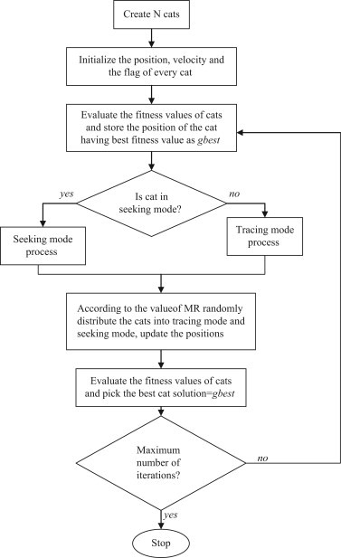

# Cat Swarm Optimization
## Foundations

Cat Swarm Optimization (CSO) is a new swarm intelligence algorithms for finding the best global solution. The CSO algorithm models the behaviour of cats into two modes (i) Seeking mode and (ii) Tracing Mode. The Swarm is made of initial population composed of particles to search in the solution space. In CSO, every cat has its own position composed of D dimensions, velocities for each dimension, a fitness value, which represents the accommodation of the cat to the fitness function, and a flag to identify whether the cat is in seeking mode or tracing mode.

* Seeking Mode

   This mode is a time for thinking and deciding about next move. It has four parameters (i) Seeking Memory Pool (SMP), (ii) Seeking Range of selected Dimension (SRD), (iii) Count of Dimensions to Change (CDC) and Self-Position Consideration (SPC).
   1. Make j copies of the present position of catk, where j = SMP.

      If the value of SPC is true, let j = (SMP – 1), then retain the present position as one of the candidates.
   2. For each copy, according to CDC, randomly plus or minus SRD percent the present values and replace the old ones.
   3. Calculate the fitness values (FS) of all candidate points.
   4. If all FS are not exactly equal, calculate the probability of each candidate point by 

   ,
   
      otherwise set all the selecting probability of each candidate point be 1.

      If the goal of the fitness is to find the minimum solution, FSb = FSmax, otherwise FSb = FSmin.
   5. Randomly pick the point to move to from the candidate points, and replace the position of catk.

* Tracing Mode

   In this mode, cats desire to trace targets and foods.
   1. Update the velocities for every dimension according to  
      Vk,d = Vk,d + r1c1 (Xbest,d - Xk,d).
   2. Check if the velocities are in the range of maximum velocity. In case the new velocity is overrange, it is set equal to the limit.
   3. Update the position of catk according to Xk,d = Xk,d + Vk,d.

      Xbest,d is the position of the cat, who has the best fitness value, Xk,d is the position of catk, c1 is an acceleration coefficient for extending the velocity of the cat to move in the solution space.

## Algorithm

* N cats are created.
* The positions, velocities and the flags for cats are initialized.
* According to the fitness function of each cat is evaluated and the best cat is kept into memory (Xbest).
* According to cat's flag the seeking mode or tracing mode process is applied.
* The number of cats are re-picked and set them into seeking mode or tracing mode according to MR parameter.
* Check the termination condition. 